<div align="center">

  

An **Agentic RAG** system for querying your personal notes and documents — with multi-turn memory, tool calling, corrective retrieval, and hallucination guarding.


</div>

---

## System Architecture

```mermaid
flowchart LR
    subgraph Client_Layer["Client Layer"]
        User(["User"])
        Frontend["Web Frontend: React 18 + Vite"]
    end

    subgraph Gateway_Layer["Backend Gateway & Memory"]
        FastAPI["FastAPI Backend Server"]
        Redis[("Redis Store: DB 0")]
        FastGreeting{"Greeting Check"}
        FastCache{"Redis Cache Hit?"}
        FastGreetingResp["Return Canned Greeting"]
        FastCacheResp["Return Cached Response"]
        PrepState["Fetch History & Build AgentState"]
    end

    subgraph Agent_Engine["LangGraph Agentic Execution Engine"]
        direction TB
        AgentEntry(["AGENT ENTRY POINT"])
        Step1["Step 1: Query Rewriter<br/>Resolve Pronouns via Redis History"]
        Step2{"Step 2: Router<br/>Classify Intent"}
        BranchSearch["Tool: Document Retrieval<br/>ChromaDB Vector Search"]
        BranchCalc["Tool: Calculator<br/>simpleeval Sandbox"]
        BranchList["Tool: Document Catalog<br/>Metadata Inspector"]

        subgraph CRAG_Subsystem["CRAG Retrieval Verification"]
            Step3Grader{"Step 3: Relevance Grader<br/>Are chunks sufficient?"}
            Step3Reform["Query Reformulator<br/>Tweak search terms"]
        end

        Step4["Step 4: Answer Synthesizer<br/>Assemble Context & Citations"]

        subgraph Guard_Subsystem["Faithfulness Verification"]
            Step5Guard{"Step 5: Hallucination Guard<br/>Are facts grounded?"}
        end

        AgentExit(["AGENT EXIT POINT"])
    end

    subgraph Vector_Layer["Vector Storage & Ingestion Pipeline"]
        Chroma[("ChromaDB: Cosine Vector Store")]
        EmbedModel["SentenceTransformer: all-MiniLM-L6-v2"]
        Docling["Docling Ingestion Engine<br/>Memory-safe Page-by-Page Streaming"]
        RawDocs["PDF / Word / PPT Notes"]
        EmbedGen["Generate Embeddings"]
    end

    subgraph Remote_Inference["Remote Inference Plane: Google Colab"]
        Tunnel["Cloudflare / ngrok Public Tunnel"]
        Ollama["Ollama Server: Qwen 2.5 7B GPU"]
    end

    %% Client & Gateway Flow
    User -->|Submit Question| Frontend
    Frontend -->|POST /chat| FastAPI
    FastAPI --> FastGreeting

    FastGreeting -->|Greeting Detected| FastGreetingResp
    FastGreetingResp --> Frontend

    FastGreeting -->|Not Greeting| FastCache
    FastCache -->|Cache Hit| FastCacheResp
    FastCacheResp --> Frontend

    FastCache -->|Cache Miss| PrepState
    PrepState --> AgentEntry

    %% Agentic Workflow
    AgentEntry --> Step1
    Step1 --> Step2

    Step2 -->|search| BranchSearch
    Step2 -->|calculate| BranchCalc
    Step2 -->|list_docs| BranchList
    Step2 -->|direct| Step4

    BranchSearch --> Step3Grader
    Step3Grader -->|"Poor Chunks (Retry < 1)"| Step3Reform
    Step3Reform -->|Re-query| BranchSearch
    Step3Grader -->|Relevant Chunks| Step4

    BranchCalc --> Step4
    BranchList --> Step4

    Step4 --> Step5Guard
    Step5Guard -->|"Ungrounded (Retry < 1)"| Step4
    Step5Guard -->|Grounded or Cap Reached| AgentExit

    %% Egress & Persistence
    AgentExit --> Persist["Update Redis History & Write Cache"]
    Persist --> ReturnResponse["Return Answer + Sources + Metadata"]
    ReturnResponse --> Frontend

    %% Vector Database & Ingestion
    RawDocs --> Docling
    Docling --> EmbedGen
    EmbedGen --> Chroma

    BranchSearch <-->|Generate Query Vector| EmbedModel
    BranchSearch <-->|"Top-K Chunks"| Chroma
    BranchList -.->|Inspect File Names| Chroma

    %% Remote LLM Inference Calls
    Tunnel <--> Ollama
    Step1 -.->|Context Rewrite Prompt| Tunnel
    Step2 -.->|Intent Classification Prompt| Tunnel
    Step3Grader -.->|Relevance Evaluation Prompt| Tunnel
    Step4 -.->|Answer Generation Prompt| Tunnel
    Step5Guard -.->|Groundedness Check Prompt| Tunnel
```



---

## Key Features

| Feature | Description |
|---|---|
| **Multi-Turn Memory** | Contextual query rewriter resolves pronouns and follow-ups using Redis conversation history |
| **Corrective RAG (CRAG)** | Grades retrieved chunks; automatically reformulates and retries the search if results are irrelevant |
| **Native Tool Calling** | Routes to `search_notes`, `calculate` (sandboxed math via `simpleeval`), or `list_docs` based on query intent |
| **Hallucination Guard** | Verifies generated answers are grounded in retrieved context before returning to the user |
| **Redis Answer Cache** | SHA-256 keyed per-session cache for instant responses on repeated queries |
| **Multi-Format Ingestion** | Docling-powered parsing for PDF, DOCX, PPTX, and TXT with memory-safe page-by-page streaming |
| **Semantic Retrieval** | `all-MiniLM-L6-v2` embeddings + ChromaDB cosine space with enhanced re-ranking |
| **React Web UI** | Multi-session sidebar, KaTeX math rendering, collapsible source citation cards |

---

## Tech Stack

| Layer | Technology |
|---|---|
| **Agentic Orchestration** | LangGraph `StateGraph` with conditional edges |
| **LLM** | Qwen 2.5:7b via Ollama on Google Colab + Cloudflare tunnel |
| **Embeddings** | `all-MiniLM-L6-v2` (SentenceTransformer, 384-dim) |
| **Vector Store** | ChromaDB (cosine distance space, persistent) |
| **Document Parsing** | Docling (OCR-off, memory-safe page streaming) |
| **Backend** | FastAPI + Uvicorn |
| **Memory & Cache** | Redis (session history + SHA-256 answer cache) |
| **Frontend** | React 18 + Vite + KaTeX |
| **Safe Math Eval** | `simpleeval` (zero arbitrary code execution) |
| **Testing** | pytest + fakeredis + pytest-mock (39 tests, 100% offline) |

---

## Quick Start

### Prerequisites
- Python 3.10+, Node.js 18+, Redis running on `localhost:6379`
- Ollama model accessible (local or via Colab tunnel) — set `OLLAMA_BASE_URL` in `.env`

### Install

```bash
git clone <repository-url>
cd inteli_docs_rag
python -m venv venv
venv\Scripts\activate          # Windows: venv\Scripts\activate
pip install -r requirements.txt
cp .env.example .env           # Edit OLLAMA_BASE_URL + GEMINI_API_KEY
cd frontend && npm install && cd ..
```

### Index Your Documents

```bash
# Place documents in data/pdf/, data/text/ or equivalent
python rebuild_vector_store.py          # Wipe & rebuild
python rebuild_vector_store.py --keep-existing  # Append mode
```

### Run

```bash
# Terminal 1 — Backend
uvicorn backend.server:app --reload

# Terminal 2 — Frontend
cd frontend && npm run dev
```

Open `http://localhost:5173` in your browser.

### Run Tests (Offline)

```bash
venv\Scripts\pytest.exe tests/    # Windows
# pytest tests/                    # Linux/macOS
```

### Live Agent Verification

```bash
python eval/test_agent.py --base-url http://localhost:8000
```

---

## Project Structure

```
inteli_docs_rag/
├── rag/
│   ├── config.py              # Centralised config (reads .env)
│   ├── pipeline.py            # EmbeddingManager, VectorStore, RAGRetriever
│   └── agent/                 # LangGraph Agentic RAG
│       ├── state.py           # AgentState TypedDict
│       ├── tools.py           # search_notes, calculate, list_available_notes
│       ├── prompts.py         # Prompt templates & JSON response parser
│       ├── nodes.py           # 9 execution nodes + conditional routing
│       └── graph.py           # build_agentic_rag_graph() factory
├── backend/
│   ├── server.py              # FastAPI routes (POST /chat, GET /sessions…)
│   └── chat_memory.py         # Redis session history + answer cache
├── frontend/src/              # React 18 + Vite UI
├── tests/                     # 39-test pytest suite (fully offline)
├── eval/
│   ├── test_agent.py          # Live verification CLI
│   └── eval_rag_updated.py    # LLM-judge evaluation (4 metrics)
├── rebuild_vector_store.py    # Document ingestion script
└── .env.example               # Environment variable template
```

---

## API Endpoints

| Method | Path | Description |
|---|---|---|
| `GET` | `/health` | Backend status + indexed document count |
| `GET` | `/sessions` | All sessions sorted by most recent |
| `GET` | `/chat/{id}/history` | Message history for a session |
| `POST` | `/chat` | Main agentic RAG endpoint |

**`POST /chat` response payload:**
```json
{
  "question": "...",
  "answer": "...",
  "sources": [...],
  "from_cache": false,
  "agent_metadata": {
    "standalone_query": "...",
    "tool_choice": "search",
    "retrieval_retried": false,
    "guard_passed": true
  }
}
```

---

## Configuration (`.env`)

```bash
OLLAMA_BASE_URL=https://xxxx.trycloudflare.com   # Colab tunnel URL
OLLAMA_MODEL=qwen2.5:7b
AGENT_MAX_RETRIES=1          # Max CRAG + hallucination guard retries
HISTORY_WINDOW_TURNS=3       # Turns of history injected into rewriter
TOP_K=5                      # Chunks retrieved per query
SCORE_THRESHOLD=0.25         # Minimum similarity score after re-ranking
```

> **Tunnel expired?** If you see `ConnectError: getaddrinfo failed`, restart the Colab tunnel cell, copy the new URL, update `OLLAMA_BASE_URL` in `.env`, and restart uvicorn.

---

> Full architecture details, Redis schema, debugging guides, and evaluation methodology: [`docs/memory.md`](docs/memory.md)
